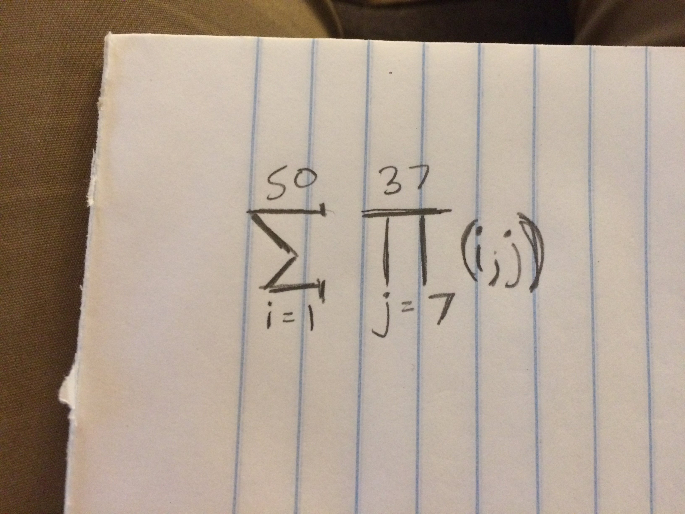
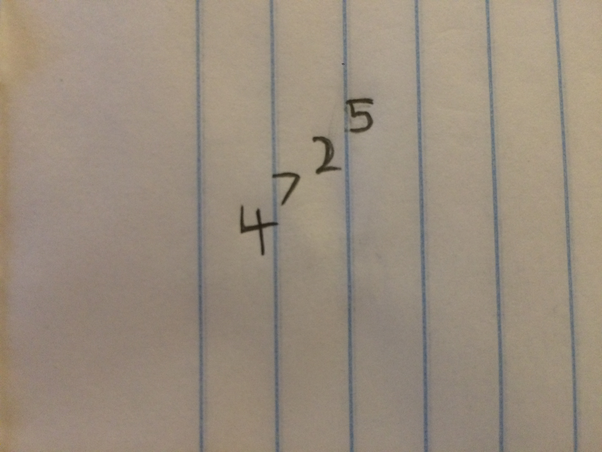
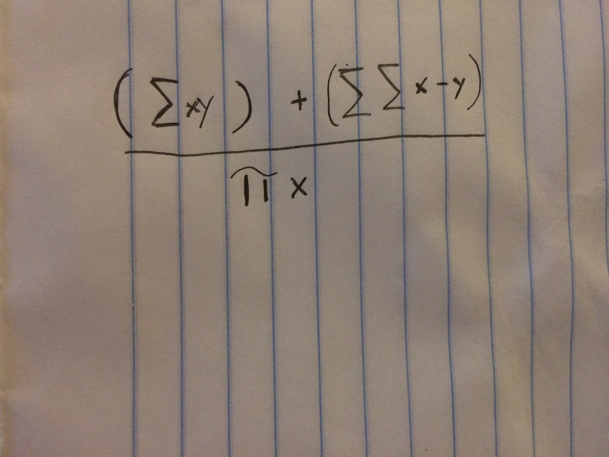

# Introduction

Welcome to introduction to Python!

This three week class will prepare you to read and write basic python scripts.  No prior programming experience required!

# Help with the homework?

Email `es3066@nyu.edu`

# Administrivia

Some homework assignments are from hackerRank.  There are a few reasons for this:

1. Teaches you how to write code that will pass tests.
2. No installation required - you don't need Python locally in order to write code here.
3. Solve real problems.

# Course Breakdown

## Week 1

* Introduction to Python - Class 1 (class time 30 minutes) - [CLASS ONE NOTES](https://github.com/18F/an_introduction_to_python/blob/master/class_one.ipynb)
	* writing your first program
	* understanding Python data types
	* if/else statements in Python
	* functions in python
	* printing to the screen
	* string processing basics - the `.format` operator.

* Standing on the shoulders of giants - Class 2 (class time 45 minutes) - [CLASS TWO NOTES](https://github.com/18F/an_introduction_to_python/blob/master/class_two.ipynb)
	* reading and writing files
	* introduction to import statements
	* introduction to the os module

## Grading

75% for homework
25% for tests

There will be two tests - one at the 3 week mark and another at the 6 week mark.

two assignments per week <-> 12 assignments

Homework:

## Assignment for class 1:

1. https://www.hackerrank.com/challenges/py-hello-world
2. https://www.hackerrank.com/challenges/python-raw-input
3. https://www.hackerrank.com/challenges/py-if-else
4. https://www.hackerrank.com/challenges/python-arithmetic-operators
5. https://www.hackerrank.com/challenges/python-division
6. https://www.hackerrank.com/challenges/write-a-function
7. https://www.hackerrank.com/challenges/python-print

## Assignment for class 2:

For this assignment you will be either creating an account on https://www.pythonanywhere.com
or downloading and installing Python locally.  If at all possible, it is better to install python locally.

But if you are restricted from doing so, PythonAnywhere works.

1. Write a Python program called create_file.py 

The program should create a file called practicing_file_writing.txt.  The file should contain the following text:

Hello!  You've successfully created this file with a program!  Congradulations!!!!

2. Write a Python program called edit_file.py

The program should open practicing_file_writing.txt and then add the following line to the end of the file:

Sincerely,
Python

So the whole file should now look like: 

Hello!  You've successfully created this file with a program!  Congradulations!!!!
Sincerely,
Python

The file should then be writen back out as practicing_file_updating.txt.

3. Create a directory called to_traverse and put the file two files created above in the directory.  Then from the directory above to_traverse put a python program called traverse_and_open.py.  This python program should change directories, read both the files into memory and then check if the two files contents are equal.

Week 2

* Introduction to Python Data Structures - Class 1 (class time 30 minutes)
	* lists
	* while loops
	* for loops
	* dictionaries
	* sets

* More file processing - Class 2 (class time 45 minutes)
	* string processing
	* using for loops to read a bunch of text from a file
	* using for loops to write a bunch of text to a file
	* using for loops to move from one directory to the next
	* working with os.walk

## Assignment for class 3:

1. https://www.hackerrank.com/challenges/python-lists
2. https://www.hackerrank.com/challenges/find-second-maximum-number-in-a-list
3. https://www.hackerrank.com/challenges/finding-the-percentage
4. https://www.hackerrank.com/challenges/py-introduction-to-sets
5. https://www.hackerrank.com/challenges/symmetric-difference
6. https://www.hackerrank.com/challenges/python-loops

## Assignment for class 4:

1. Write a program called traversal.py - This file will traverse the entire file system, starting at the first directory you give it.

2. Write a new program called print_traversal.py - this file will traverse the entire file system, starting at the first directory you give it and print out the full paths of every filename it traverses.

3. Write a new program called print_analyze_traversal.py - this file traverse the entire file system, starting at the first directory you give it and print out the full paths of every filename it traverses.  Also it will record the number of times the file is a python file and the number of times it is not.  At the end of the program, the program should print out how many python files were found and how many non-python files were found.  It should print this out in absolute terms and relative terms.  Example:

total number of python files found: 5
total number of non-python files found: 500
percentage of python files: 1%
percentage of non-python files: 99%

Week 3

* Introduction to methods - Class 1 (class time 30 minutes)
	* methods on integers
	* methods on strings
	* methods on lists
	* working with dictionaries

* Making use of methods on strings with files (class time 45 minutes)
	* advanced string processing
	* reading files and processing them as strings in Python
	* traversing directories to look for patterns
	* introduction to very basic regular expressions

## Assignment for class 5:

* Do every question in this section - https://www.hackerrank.com/domains/python/py-strings
* Do every question in this section - https://www.hackerrank.com/domains/python/py-math

## Assignment for class 6:

Now that you have an understanding of how to iterate over a set of things, let's make use of that to really do something interesting!  

1. write a program called find.py.  This program will start at whatever directory you give it and traverse until it finds a specific string.  In this case, the string will be Hello there!  If the string is never found, after looking through all subfolders and files, the program terminates with, couldn't find the string.

How you'll call the file: python find.py dir_name

2. Now you'll be creating a new program called find_replace.py.  This program will do the same traversal as the last program, except, it will also open any files with Hello there! edit that line to say Hi instead of Hello there! and close the file, writing it back out to the file system.

3. Now you'll be going even further - now instead of looking for a simple find and replace, you'll be adding descriptive statistics to any files you find.  The descriptive statistics you'll be adding are:

1. the number of lines in the file
2. the five most commonly used words in the file
3. if the file is a program, what language is it written in

Note you should write functions for each of these sub commands.  Here's what a typical output should look like:

This file has 10 lines
The five most common words used are: print, if, else, import, and
This file is written in Python

Week 4

## Assignment for class 7:

1. Take the floor of the following number: 3.4
2. Take the ceiling of the following number: 3.4
3. Explain the difference of the floor and ceiling function.  Can you think of a situation where you would use one or the other?  Are they interchangable?

4. Take the gcd of the numbers 4, 7 and 11.

Convert the following mathematical expressions into Python code and evaluate:

5. Find 
6. Evaluate with Python 
7. Write the Python function equivalence to 
